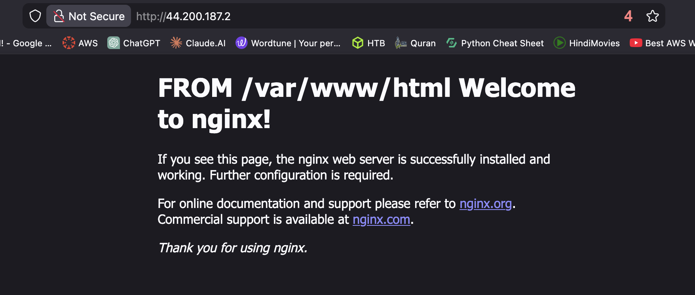

# Ansible Nginx Deployment on AWS EC2

This project demonstrates how to use **Ansible** to automate the installation and configuration of **Nginx** on AWS EC2 instances. It also includes deploying a custom landing page.

---

## What is Ansible?

**Ansible** is an open-source automation tool used for **configuration management, application deployment, and infrastructure orchestration**. It allows you to automate repetitive tasks across multiple servers using simple, human-readable YAML files called **playbooks**, without requiring agents on the target machines. Ansible is widely used in DevOps to ensure consistent and scalable infrastructure management.

---

## Project Overview

In this project, we:

- Automate repetitive tasks across EC2 servers using Ansible.
- Install and configure Nginx on multiple EC2 instances.
- Deploy a custom HTML landing page.

---

## Prerequisites

- 2 AWS EC2 Ubuntu servers
- Port 80 open in security groups
- Ansible installed on the control machine
- SSH access to EC2 instances with private key

---

## Inventory.yml

```yaml
ec2_nodes:
  hosts:
    ser001:
      ansible_host: 98.92.17.3
      ansible_port: 22
      ansible_user: ubuntu
      ansible_ssh_private_key_file: ~/Downloads/awsKeyPair.pem
      ansible_ssh_common_args: '-o StrictHostKeyChecking=no'
    ser002:
      ansible_host: 54.92.199.228
      ansible_port: 22
      ansible_user: ubuntu
      ansible_ssh_private_key_file: ~/Downloads/awsKeyPair.pem
      ansible_ssh_common_args: '-o StrictHostKeyChecking=no'

```

## playbook-nginx.yml

```yaml
---
- name: Install and Configure Nginx on EC2 Nodes
  hosts: ec2_nodes
  become: true

  tasks:

    - name: Update apt cache
      apt:
        update_cache: yes

    - name: Install nginx
      apt:
        name: nginx
        state: present

    - name: Ensure nginx is running and enabled
      service:
        name: nginx
        state: started
        enabled: true

```

## Run the playbook

```yaml
ansible-playbook -i inventory.yml playbook-nginx.yaml
```

## Outputs



## Display custom Nginx landing page

### index.html

```html
<!DOCTYPE html>
<html>
<head>
    <title>My Ansible Deployment</title>
</head>
<body>
    <h1>Hello from Ansible 🚀</h1>
    <p>This server is deployed via Ansible.</p>
</body>
</html>
```

### playbook-custom-nginx.yml

```html

- name: Install and Configure Nginx on EC2 Nodes
  hosts: ec2_nodes
  become: true

  tasks:

    - name: Update apt cache
      apt:
        update_cache: yes

    - name: Install nginx
      apt:
        name: nginx
        state: present
        
    - name: Copy custom index.html
      copy:
        src: files/index.html
        dest: /var/www/html/index.html
        owner: www-data
        group: www-data
        mode: 0644
	    

    - name: Ensure nginx is running and enabled
      service:
        name: nginx
        state: started
        enabled: true

```

```html
ansible-playbook -i inventory.yml playbook-custom-nginx.yml
```

### Outputs

